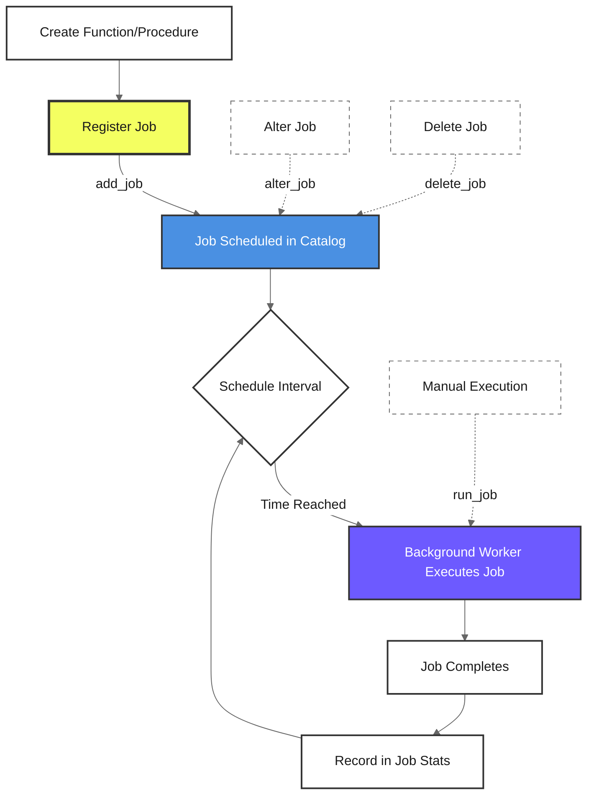

```mermaid
%%{init: {'theme':'base', 'themeVariables': {
  'primaryColor':'#F4FF61',
  'primaryTextColor':'#1a1a1a',
  'primaryBorderColor':'#333',
  'lineColor':'#666',
  'secondaryColor':'#6D5AFF',
  'secondaryTextColor':'#fff',
  'secondaryBorderColor':'#333',
  'tertiaryColor':'#4A90E2',
  'tertiaryTextColor':'#fff',
  'tertiaryBorderColor':'#333',
  'noteBkgColor':'#F4FF61',
  'noteTextColor':'#1a1a1a',
  'noteBorderColor':'#333',
  'background':'#fff',
  'mainBkg':'#fff',
  'fontFamily':'Inter, system-ui, -apple-system, sans-serif',
  'edgeLabelBackground':'#fff',
  'labelColor':'#333',
  'labelTextColor':'#333'
}, 'flowchart': {'padding': 20, 'htmlLabels': true, 'curve': 'basis'}}}%%
graph TB
    A[Create Function/Procedure] --> B[" Register Job "]
    B -->|add_job| C[Job Scheduled in Catalog]
    C --> D{Schedule Interval}
    D -->|Time Reached| E[Background Worker Executes Job]
    E --> F[Job Completes]
    F --> G[Record in Job Stats]
    G --> D

    H[" Manual Execution "] -.->|run_job| E
    I[" Alter Job "] -.->|alter_job| C
    J[" Delete Job "] -.->|delete_job| C

    style A fill:#fff,stroke:#333,stroke-width:2px,color:#1a1a1a
    style B fill:#F4FF61,stroke:#333,stroke-width:3px,color:#1a1a1a
    style C fill:#4A90E2,stroke:#333,stroke-width:2px,color:#fff
    style D fill:#fff,stroke:#333,stroke-width:2px,color:#1a1a1a
    style E fill:#6D5AFF,stroke:#333,stroke-width:2px,color:#fff
    style F fill:#fff,stroke:#333,stroke-width:2px,color:#1a1a1a
    style G fill:#fff,stroke:#333,stroke-width:2px,color:#1a1a1a
    style H fill:#fff,stroke:#666,stroke-width:1px,stroke-dasharray: 5 5,color:#1a1a1a,padding:20px
    style I fill:#fff,stroke:#666,stroke-width:1px,stroke-dasharray: 5 5,color:#1a1a1a,padding:20px
    style J fill:#fff,stroke:#666,stroke-width:1px,stroke-dasharray: 5 5,color:#1a1a1a,padding:20px

    click B "/api-reference/timescaledb/jobs-automation/add_job" "add_job API reference"
    click H "/api-reference/timescaledb/jobs-automation/run_job" "run_job API reference"
    click I "/api-reference/timescaledb/jobs-automation/alter_job" "alter_job API reference"
    click J "/api-reference/timescaledb/jobs-automation/delete_job" "delete_job API reference"
```
